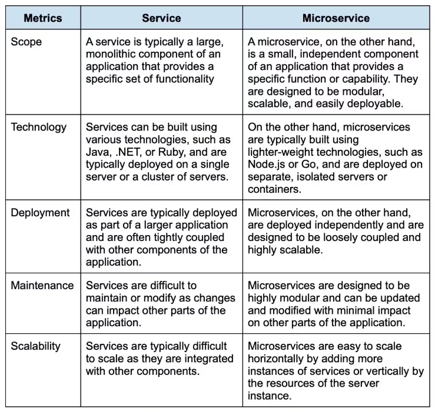

# **Interview Questions**

## **Basic Level:**  

### **Q1. What is DevOps? explain in simple words?**
**Answer:** 
DevOps is the combination of cultural philosophies, practices, and tools that helps compaines/organizations deliver applications and services faster & efficitently.

"**DevOps**" represents "**Dev**" and "**Ops**" which stands for "**Development Team**" & "**Operations Team**", DevOps promotes communications and collaborations between Development and Operations teams, share many responsibilities, and combine their workflows. This reduces inefficiences and save time

### **Q2. What is the popular DevOps Practices? mention some popular related Tools for the same?**
**Answer:** 

### **Q2 What benefits does DevOps have in business?**

**Answer:**
DevOps can bring several benefits to a business, such as:

* **Faster time to market**: DevOps practices can help to streamline the development and deployment process, allowing for faster delivery of new products and features.
* **Increased collaboration**: DevOps promotes collaboration between development and operations teams, resulting in better communication, more efficient problem-solving, and higher-quality software.
* **Improved agility**: DevOps allows for more rapid and flexible responses to changing business needs and customer demands.
* **Increased reliability**: DevOps practices such as continuous testing, monitoring, and automated deployment can help to improve the reliability and stability of software systems.
* **Greater scalability**: DevOps practices can help to make it easier to scale systems to meet growing business needs and user demand.
* **Cost savings**: DevOps can help to reduce the costs associated with the development, deployment, and maintenance of software systems by automating many manual processes and reducing downtime.
* **Better security**: DevOps practices such as continuous testing and monitoring can help to improve the security of software systems.

### Q3. What are the key components of a successful DevOps workflow?**

**Answer:**
The key components include Continuous Integration (CI), Continuous Delivery (CD), Automated testing, Infrastructure as Code (IaC), Configuration Management, Monitoring & Logging, and Collaboration & Communication.

### **Q4. What are the different phases of the DevOps lifecycle?**

**Answer:**
 The DevOps lifecycle is designed to streamline the development process, minimize errors and defects, and ensure that software is delivered to end-users quickly and reliably. The different phases of the DevOps lifecycle are:

* **Plan**: Define project goals, requirements, and resources
* **Code**: Develop and write code
* **Build**: Compile code into executable software
* **Test**: Verify and validate software functionality
* **Release**: Deploy code to the production environment
* **Deploy**: Automated deployment and scaling of software
* **Operate**: Monitor and maintain the software in production
* **Monitor**: Collect and analyze software performance data
* **Optimize**: Continuously improve and evolve the software system

### **Q5. What are the best programming and scripting languages for DevOps engineers?**

**Answer:** 
The best programming and scripting languages DevOps engineers must know are as follows:

**Programming languages:-**

* Bash
* SQL
* Go
* Terraform (Infrastructure as Code)
* Ansible (Automation and Configuration Management)
* Puppet (Automation and Configuration Management)

**Scripting languages:-**

* JavaScript
* Python
* Ruby
* Perl
* Groovy

### **Q6. Explain configuration management in DevOps.**

**Answer:**
Configuration Management (CM) is a practice in DevOps that involves organizing and maintaining the configuration of software systems and infrastructure. It includes version control, monitoring, and change management of software systems, configurations, and dependencies.

The goal of CM is to ensure that software systems are consistent and reliable to make tracking and managing changes to these systems easier. This helps to minimize downtime, increase efficiency, and ensure that software systems remain up-to-date and secure.

Configuration Management is often performed using tools such as Ansible, Puppet, Chef, and SaltStack, which automate the process and make it easier to manage complex software systems at scale.

### **Q7. Name and explain trending DevOps tools.**

**Answer:**
* **Docker:** A platform for creating, deploying, and running containers, which provides a way to package and isolate applications and their dependencies.

* **Kubernetes:** An open-source platform for automating containers' deployment, scaling, and management.

* **Ansible:** An open-source tool for automating configuration management and provisioning infrastructure.

* **Jenkins:** An open-source tool to automate software development, testing, and deployment.

* **Terraform:** An open-source tool for managing and provisioning infrastructure as code.

* **GitLab:** An open-source tool that provides source code management, continuous integration, and deployment pipelines in a single application.

* **Nagios:** An open-source tool for monitoring and alerting on the performance and availability of software systems.

* **Grafana:** An open-source platform for creating and managing interactive, reusable dashboards for monitoring and alerting.

* **ELK Stack:** A collection of open-source tools for collecting, analyzing, and visualizing log data from software systems.

* **New Relic:** A SaaS-based tool for monitoring, troubleshooting, and optimizing software performance.

### **Q8. How would you strategize for a successful DevOps implementation?**

**Answer:** 
For a successful DevOps implementation, I will follow the following steps:

* Define the business objectives
* Build cross-functional teams
* Adopt agile practices
* Automate manual tasks
* Implement continuous integration and continuous delivery
* Use infrastructure as code
* Monitor and measure
* Continuously improve
* Foster a culture of learning to encourage experimentation and innovation

### **Q9. What role does AWS play in DevOps?***

**Answer:** 
AWS provides a highly scalable and flexible cloud infrastructure for hosting and deploying applications, making it easier for DevOps teams to manage and scale their software systems. Moreover, it offers a range of tools and services to support continuous delivery, such as AWS CodePipeline and AWS CodeDeploy, which automate the software release process.

AWS CloudFormation and AWS OpsWorks allow automation of the management and provisioning of infrastructure and applications. Then we have Amazon CloudWatch and Amazon CloudTrail, which enable the teams to monitor and log the performance and behavior of their software systems, ensuring reliability and security.

AWS also supports containerization through Amazon Elastic Container Service and Amazon Elastic Kubernetes Service. It also provides serverless computing capabilities through services such as AWS Lambda. In conclusion, AWS offers a range of DevOps tools for efficient and successful DevOps implementation.

### **Q10. DevOps vs. Agile: How are they different?**

**Answer:**
DevOps and Agile are both methodologies used to improve software development and delivery, but they have different focuses and goals:

* **Focus:** Agile is focused primarily on the development process and the delivery of high-quality software, while DevOps is focused on the entire software delivery process, from development to operations.

* **Goals:** The goal of Agile is to deliver software in small, incremental updates, with a focus on collaboration, flexibility, and rapid feedback. DevOps aims to streamline the software delivery process, automate manual tasks, and improve collaboration between development and operations teams.

* **Teams:** Agile teams mainly focus on software development, while DevOps teams are cross-functional and their job include both development and operations.

* **Processes:** Agile uses iterative development processes, such as Scrum or Kanban, to develop software, while DevOps uses a continuous delivery process that integrates code changes, testing, and deployment into a single, automated pipeline.

* **Culture:** Agile emphasizes a culture of collaboration, continuous improvement, and flexible responses to change, while DevOps emphasizes a culture of automation, collaboration, and continuous improvement across the entire software delivery process.

### **Q11. What is a container, and how does it relate to DevOps?**

**Answer:**
A container is a standalone executable package that includes everything needed to run a piece of software, including the code, runtime, libraries, environment variables, and system tools. Containers are related to DevOps because they enable faster, more consistent, and more efficient software delivery.

### **Q12. Explain Component-based development in DevOps.**

**Answer:**
Component-based development, also known as **CBD**, is a unique approach to product development. In this, developers search for pre-existing well-defined, verified, and tested code components instead of developing from scratch.

### **Q13. How is version control crucial in DevOps?**

**Answer:**
Version control is crucial in DevOps because it allows teams to manage and save code changes and track the evolution of their software systems over time. Some key benefits include collaboration, traceability, reversibility, branching, and release management.

### **Q14. Describe continuous integration.**

**Answer:**
**Continuous integration** (CI) is a software development methodology where developers frequently integrate their code changes into a shared repository. 
To detect and correct mistakes as soon as feasible, each integration is then tested using automated build and test scripts.

### **Q15. What is continuous delivery?**

**Answer:**
A software development method, "Continuous Delivery," involves automatically building, testing, and getting code updates ready for production release. 
This guarantees that the software is constantly deployable and available for delivery to consumers at any moment.

###  **Q16. Explain continuous testing.**

**Answer**
Continuous testing is a software testing practice that involves automating the testing process and integrating it into the continuous delivery pipeline. The goal of continuous testing is to catch and fix issues as early as possible in the development process before they reach production.

### **Q17. What is continuous monitoring?**

**Answer**
Continuous monitoring is a software development practice that involves monitoring applications' performance, availability, and security in production environments. The goal is to detect and resolve issues quickly and efficiently to ensure that the application remains operational and secure.

### **Q18. What key metrics should you focus on for DevOps success?** 

**Answer**
Focusing on the right key metrics can provide valuable insights into your DevOps processes and help you identify areas for improvement. Here are some key metrics to consider:

* **Deployment frequency:** Measures how often new builds or features are deployed to production. Frequent deployments can indicate effective CI/CD processes, while rare deployments can hint at bottlenecks or inefficiencies.

* **Change lead time:** The time it takes for code changes to move from initial commit to deployment in a production environment. A low change lead time can indicate agile processes that allow for quick adaptation and innovation.

* **Mean time to recovery (MTTR):** The average time it takes to restore a system or service after an incident or failure. A low MTTR indicates that the DevOps team can quickly identify, diagnose, and resolve issues, minimizing service downtime.

* **Change failure rate:** The percentage of deployments that result in a failure or require a rollback or hotfix. A low change failure rate suggests effective testing and deployment strategies, reducing the risk of introducing new issues.

* **Cycle time:** The total time it takes for work to progress from start to finish, including development, testing, and deployment. A short cycle time indicates an efficient process and faster delivery of value to customers.

* **Automation percentage:** The proportion of tasks that are automated within the CI/CD pipeline. High automation levels can accelerate processes, reduce human error, and improve consistency and reliability.

* **Test coverage:** Measures the percentage of code or functionality covered by tests, which offers insight into how thoroughly your applications are being tested before deployment. High test coverage helps ensure code quality and reduces the likelihood of production issues.

* **System uptime and availability:** Monitors the overall reliability and stability of your applications, services, and infrastructure. A high uptime percentage indicates more resilient and reliable systems.

* **Customer feedback:** Collects quantitative and qualitative data on user experience, satisfaction, and suggestions for improvement. This metric can reveal how well the application or service is aligning with business objectives and meeting customer needs.

* **Team collaboration and satisfaction:** Measures the effectiveness of communication, efficiency, and morale within the DevOps teams. High satisfaction levels can translate to more productive and successful DevOps practices.

### **Q19. List down the types of HTTP requests.**

**Answer**
HTTP requests (methods) play a crucial role in DevOps when interacting with APIs, automation, webhooks, and monitoring systems. Here are the main HTTP methods used in a DevOps context:

* **GET:** Retrieves information or resources from a server. Commonly used to fetch data or obtain status details in monitoring systems or APIs.

* **POST:** Submits data to a server to create a new resource or initiate an action. Often used in APIs to create new items, trigger builds, or start deployments.

* **PUT:** Updates a resource or data on the server. Used in APIs and automation to edit existing information or re-configure existing resources.

* **PATCH:** Applies partial updates to a resource on the server. Utilized when only a certain part of the data needs an update, rather than the entire resource.

* **DELETE:** Deletes a specific resource from the server. Use this method to remove data, stop running processes, or delete existing resources within automation and APIs.

* **HEAD:** Identical to GET but only retrieves the headers and not the body of the response. Useful for checking if a resource exists or obtaining metadata without actually transferring the resource data.

* **OPTIONS:** Retrieves the communication options available for a specific resource or URL. Use this method to identify the allowed HTTP methods for a resource, or to test the communication capabilities of an API.

* **CONNECT:** Establishes a network connection between the client and a specified resource for use with a network proxy.

* **TRACE:** Retrieves a diagnostic representation of the request and response messages for a resource. It is mainly used for testing and debugging purposes.

### **Q20. What is the role of automation in DevOps?**

**Answer**
Automation plays a critical role in DevOps, allowing teams to develop, test, and deploy software more efficiently by reducing manual intervention, increasing consistency, and accelerating processes. Key aspects of automation in DevOps include Continuous Integration (CI), Continuous Deployment (CD), Infrastructure as Code (IaC), Configuration Management, Automated Testing, Monitoring and Logging, Automated Security, among others. By automating these aspects of the software development lifecycle, DevOps teams can streamline their workflows, maximize efficiency, reduce errors, and ultimately deliver higher-quality software faster.

### **Q21. What is the difference between a service and a microservice?**

**Answer**
A service and a microservice are both architectural patterns for building and deploying software applications, but there are some key differences between them:

### **Q22. How do you secure a CI/CD pipeline?**

**Answer**
To secure a CI/CD pipeline, follow these steps:

* Ensure all tools and dependencies are up to date
* Implement strong access controls and authentication
* Scan code for vulnerabilities (e.g., SonarQube, OWASP Dependency-Check)
* Cloud provider managed private build environments (e.g., AWS CodeBuild)
* Store sensitive data like keys, tokens, and passwords in a secret management tool (e.g., HashiCorp Vault, AWS Secrets Manager)
* Regularly audit infrastructure and system logs for anomalies

### **Q23. How does incident management fit into the DevOps workflow?**

**Answer**
Incident management is a crucial component of the DevOps workflow, as it helps quickly resolve issues in the production environment and prevent them from becoming bigger problems.

###  **Q24. What is the difference between a git pull and a git fetch?**

**Answer**
git pull and git fetch are two distinct commands in Git that serve different purposes, primarily related to updating a local repository with changes from a remote repository

git pull is a combination of git fetch and git merge. It retrieves data from the remote repository and automatically merges it into the local branch.

git fetch is used to retrieve data from remote repositories, but it does not automatically merge the data into the local branch. It only downloads the data and stores it in the local repository as a separate branch, which means the developer must manually merge the fetched data with the remote branch.

### **Q25. What is the difference between a container and a virtual machine?**

**Answer**
A container and a virtual machine are both technologies used for application virtualization. However, there are some key differences between the two.

A virtual machine runs an entire operating system, which can be resource-intensive, while a container shares the host operating system and only includes the necessary libraries and dependencies to run an application, making it lighter and more efficient.

Containers provide isolation between applications, while virtual machines provide complete isolation from the host operating system and other virtual machines.

## **Intermediate DevOps technical level:**

